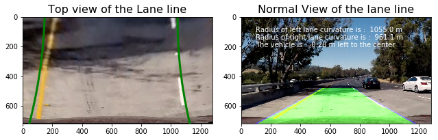

# Advanced Lane Finding Project
---

**Advanced Lane Finding Project**

The goals / steps of this project are the following:

* Compute the camera calibration matrix and distortion coefficients given a set of chessboard images.
* Apply a distortion correction to raw images.
* Use color transforms, gradients, etc., to create a thresholded binary image.
* Apply a perspective transform to rectify binary image ("birds-eye view").
* Detect lane pixels and fit to find the lane boundary.
* Determine the curvature of the lane and vehicle position with respect to center.
* Warp the detected lane boundaries back onto the original image.
* Output visual display of the lane boundaries and numerical estimation of lane curvature and vehicle position.


## Import packages


```python
import numpy as np
import matplotlib.pyplot as plt
import matplotlib.image as mpimg
import cv2
import os
import glob
```

## Camera calibrition
---
In this section, the chessboard images provided will be un-distorted and the calibration matrix will be calculated.


```python
imgs = glob.glob('camera_cal/calibration*.jpg')

# arrays to store object points and image points from all the images
objpoints = [] 
imgpoints = []

# obj points preparation
objp = np.zeros((6*9,3),np.float32)
objp[:,:2] = np.mgrid[0:9,0:6].T.reshape(-1,2) # x,y coordinate 
for fname in imgs:
    img = mpimg.imread(fname)
    gray = cv2.cvtColor(img,cv2.COLOR_BGR2GRAY)
    ret,corners = cv2.findChessboardCorners(gray , (9,6), None)
    if ret == True:
        imgpoints.append(corners)
        objpoints.append(objp)
        #cv2.drawChessboardCorners(img, (9,6), corners,ret)
        #f, (ax1, ax2) = plt.subplots(1, 2, figsize=(8,4))
        #ax1.imshow(cv2.cvtColor(mpimg.imread(fname), cv2.COLOR_BGR2RGB))
        #ax1.set_title('Original Image', fontsize=18)
        #ax2.imshow(cv2.cvtColor(img, cv2.COLOR_BGR2RGB))
        #ax2.set_title('With Corners', fontsize=18)

```

Here we will define a calculation of undistort function:


```python
def cal_undistort(img,read,plot):
    if read == True:
        img = mpimg.imread(img)
    img_size = (img.shape[1],img.shape[0])
    ret, mtx, dist, rvecs, tvecs = cv2.calibrateCamera(objpoints, imgpoints, img_size, None, None)
    undist = cv2.undistort(img, mtx, dist, None, mtx)
    if plot == True:
        f, (ax1, ax2) = plt.subplots(1, 2, figsize=(24,9))
        f.tight_layout()
        ax1.imshow(img)
        ax1.set_title('Original Image',fontsize = 50)
        ax2.imshow(undist)
        ax2.set_title('Undistorted Image',fontsize = 50)
    return undist   
```

By using the objpoints and imgpoints matrix from the chessboard, we can calculate the distortion matrix. And we take the chessboard figure 'calibration2' as an example to undistort.


```python
img = mpimg.imread('camera_cal/calibration2.jpg')
calibration2 = cal_undistort(img,False,True)

```


# Pipeline construction

In this pipline, we will follow the course instruction's order to process the images:

* Undistort the original images
* Find the binary selection of the images by combined color and gradient threshold to the undistorted images
* Apply perspective transformation to the binary images
* Measure the curvature and fit a polynomial for the lane lines
* Plot out the found lane lines on the image/vedio


##   Undistort the test images

Now we use the algorithms we developed previously to undistort the test images 


```python
images = glob.glob('test_images/test*.jpg')
for image in images:
    undist = cal_undistort(image,True,True)
```


## Find the binary selections of the images
---

Here we use the HSV color space to filter out the yellow and white line of the lane. This is done by tuning the threshold for white and yellow and combine the binary selection of white and yellow color.


```python
def combine_binay(img,read,display):
    if read == True:
        img = mpimg.imread(img)        
    
    img = cal_undistort(img,False,False)
    img = np.copy(img)    
    # Convert to HLS color space and separate the V channel
    hsv = cv2.cvtColor(img, cv2.COLOR_RGB2HSV)
    h_channel = hsv[:,:,0]
    s_channel = hsv[:,:,1]
    v_channel = hsv[:,:,2]
    
    img = np.copy(img)   
    #Define parameters
    white_low = (0, 0, 233)
    white_high =(90, 63, 255)
    yellow_low = (15, 127, 213)
    yellow_high = (30, 255, 255)
    
    
    
    white_binary = cv2.inRange(hsv,white_low,white_high)
    yellow_binary = cv2.inRange(hsv,yellow_low,yellow_high)
    combine_bi = cv2.bitwise_or(white_binary,yellow_binary)
    if display == True:
        f, (ax1, ax2) = plt.subplots(1, 2, figsize=(24,9))
        f.tight_layout()
        ax1.imshow(cal_undistort(img,False,False))
        ax1.set_title('Undistorted Image',fontsize = 50)
        ax2.imshow(combine_bi, cmap='gray')
        ax2.set_title('Selected Binary', fontsize=50)
        plt.subplots_adjust(left=0., right=1, top=0.9, bottom=0.)
    return combine_bi
```

Here we take the image 'test1.jpg' as an example and we can see the selecte binary clearly shows the yellow lane and the white lane.


```python
image = mpimg.imread('test_images/test1.jpg')
binary = combine_binay(image,False,True)
```


The binary selection of all the test images are shown as below:


```python
images = glob.glob('test_images/test*.jpg')
for image in images:
    binary = combine_binay(image,True,True)
```


## Perspective transformation
---


```python
def corners_unwarp(img,read,display,inv):
    if read == True:
        img = mpimg.imread(img)
    src = np.float32(
        [[500,480],
         [800,480],
         [1200,700],
         [100,700]])
    dst = np.float32(
        [[0,0],
         [1200,0],
         [1200,700],
         [0,700]])
    img_size = (img.shape[1],img.shape[0])
    M = cv2.getPerspectiveTransform(src, dst)
    M_inv = cv2.getPerspectiveTransform(dst, src)
    warped = cv2.warpPerspective(img, M, img_size, flags=cv2.INTER_LINEAR)
    warped_bi = combine_binay(warped,False,False)
    if display == True:
        f, (ax1,ax2) = plt.subplots(1,2,figsize = (20,10))
        ax1.set_title('Original')
        ax1.imshow(img)
        ax2.set_title('Wraped')
        ax2.imshow(warped,cmap='gray')
    if inv == True:
        return M_inv,warped_bi, warped
    else:
        return warped_bi, warped
```

Images after perspective transformation can be shown as below:


```python
images = glob.glob('test_images/test*.jpg')
for image in images:
    binary,warped = corners_unwarp(image,True,True,False)
```


## Lane finding using peaks in a histogram

### Finding the lane line with fitted curves
---

In the following part, we first find the nonzero points in the warped binary selection of test images; then we use histogram to find out the left and right end of lanes; third, we use sliding windows to find the possible left and right lane pixel; then we implement 2nd order curve fitting to find the coefficients of the lane lines; finally, we plot out the found lane lines at the original image with texts showing the curvature and offset.


```python
def fit_polynomial(img):
    M_inv,binary_warped,warped = corners_unwarp(img,False,False,True)
    binary_all = combine_binay(img,False,False)
    # Take a histogram of the bottom half of the image
    histogram = np.sum(binary_warped[binary_warped.shape[0]//2:,:], axis=0)
    # Create an output image to draw on and visualize the result
    out_img = np.dstack((binary_warped, binary_warped, binary_warped))
    # Find the peak of the left and right halves of the histogram
    # These will be the starting point for the left and right lines
    midpoint = np.int(histogram.shape[0]//2)
    leftx_base = np.argmax(histogram[:midpoint])
    rightx_base = np.argmax(histogram[midpoint:]) + midpoint

    # HYPERPARAMETERS
    # Check or not the windows
    w_check = False
    # Choose the number of sliding windows
    nwindows = 9
    # Set the width of the windows +/- margin
    margin = 100
    # Set minimum number of pixels found to recenter window
    minpix = 50

    # Set height of windows - based on nwindows above and image shape
    window_height = np.int(binary_warped.shape[0]//nwindows)
    # Identify the x and y positions of all nonzero pixels in the image
    nonzero = binary_warped.nonzero()
    nonzeroy = np.array(nonzero[0])
    nonzerox = np.array(nonzero[1])
    # Current positions to be updated later for each window in nwindows
    leftx_current = leftx_base
    rightx_current = rightx_base

    # Create empty lists to receive left and right lane pixel indices
    left_lane_inds = []
    right_lane_inds = []

    # Step through the windows one by one
    for window in range(nwindows):
        # Identify window boundaries in x and y (and right and left)
        win_y_low = binary_warped.shape[0] - (window+1)*window_height
        win_y_high = binary_warped.shape[0] - window*window_height
        ### TO-DO: Find the four below boundaries of the window ###
        win_xleft_low = leftx_current - margin   # Update this
        win_xleft_high = leftx_current + margin  # Update this
        win_xright_low = rightx_current - margin  # Update this
        win_xright_high = rightx_current + margin  # Update this
        
        if w_check == True:
            # Draw the windows on the visualization image
            cv2.rectangle(out_img,(win_xleft_low,win_y_low),
            (win_xleft_high,win_y_high),(0,255,0), 2) 
            cv2.rectangle(out_img,(win_xright_low,win_y_low),
            (win_xright_high,win_y_high),(0,255,0), 2) 
        
        ### TO-DO: Identify the nonzero pixels in x and y within the window ###
        good_left_inds = ((nonzeroy >= win_y_low) & (nonzeroy < win_y_high) & 
        (nonzerox >= win_xleft_low) &  (nonzerox < win_xleft_high)).nonzero()[0]
        good_right_inds = ((nonzeroy >= win_y_low) & (nonzeroy < win_y_high) & 
        (nonzerox >= win_xright_low) &  (nonzerox < win_xright_high)).nonzero()[0]
        
        # Append these indices to the lists
        left_lane_inds.append(good_left_inds)
        right_lane_inds.append(good_right_inds)
        
        if len(good_left_inds) > minpix:
            leftx_current = np.int(np.mean(nonzerox[good_left_inds]))
        if len(good_right_inds) > minpix:
            rightx_current = np.int(np.mean(nonzerox[good_right_inds]))

    # Concatenate the arrays of indices (previously was a list of lists of pixels)
    try:
        left_lane_inds = np.concatenate(left_lane_inds)
        right_lane_inds = np.concatenate(right_lane_inds)
    except ValueError:
        # Avoids an error if the above is not implemented fully
        pass

    # Extract left and right line pixel positions
    leftx = nonzerox[left_lane_inds]
    lefty = nonzeroy[left_lane_inds] 
    rightx = nonzerox[right_lane_inds]
    righty = nonzeroy[right_lane_inds]
    
    dots = False

    left_fit = np.polyfit(lefty,leftx,2)
    right_fit = np.polyfit(righty,rightx,2)

    # Generate x and y values for plotting
    ploty = np.linspace(0, binary_warped.shape[0]-1, binary_warped.shape[0] )
    try:
        left_fitx = left_fit[0]*ploty**2 + left_fit[1]*ploty + left_fit[2]
        right_fitx = right_fit[0]*ploty**2 + right_fit[1]*ploty + right_fit[2]
        ym_per_pix = 30/720 # meters per pixel in y dimension
        xm_per_pix = 3.7/700 # meters per pixel in x dimension
        y_eval = np.max(ploty)
        y_eval = y_eval*ym_per_pix
        left_fit_real = np.polyfit(lefty*ym_per_pix,leftx*xm_per_pix,2)
        right_fit_real = np.polyfit(righty*ym_per_pix,rightx*xm_per_pix,2)
        left_curverad = ((1 + (2*left_fit_real[0]*y_eval + left_fit_real[1])**2)**1.5) / np.absolute(2*left_fit_real[0])
        right_curverad = ((1 + (2*right_fit_real[0]*y_eval + right_fit_real[1])**2)**1.5) / np.absolute(2*right_fit_real[0])
    except TypeError:
        # Avoids an error if `left` and `right_fit` are still none or incorrect
        print('The function failed to fit a line!')
        left_fitx = 1*ploty**2 + 1*ploty
        right_fitx = 1*ploty**2 + 1*ploty
        
        
    # Find the position of the vehicle
    start_ind = binary_warped.shape[0]-1
    left_start = left_fitx[start_ind]
    right_start = right_fitx[start_ind]
    center_pos = (left_start+right_start)/2
    offset_pix = 640 - center_pos
    offset = (3.7/700)*offset_pix
    
        
    # Create an image to draw the lines on    
    warp_zero = np.zeros_like(binary_all).astype(np.uint8)
    color_warp = np.dstack((warp_zero, warp_zero, warp_zero))
    
    # Recast the x and y points into usable format for cv2.fillPoly()
    pts_left = np.array([np.flipud(np.transpose(np.vstack([left_fitx, ploty])))])
    pts_right = np.array([np.transpose(np.vstack([right_fitx, ploty]))])
    pts = np.hstack((pts_left, pts_right))
    
    # Draw the lane onto the warped blank image
    cv2.polylines(color_warp, np.int_([pts]), isClosed=False, color=(0,0,255), thickness = 40)
    cv2.fillPoly(color_warp, np.int_([pts]), (0,255, 0))
    
    # Warp the blank back to original image space using inverse perspective matrix (Minv)
    newwarp = cv2.warpPerspective(color_warp, M_inv, (binary_all.shape[1], binary_all.shape[0]))
    
    # Combine the result with the original image
    result = cv2.addWeighted(img, 1, newwarp, 0.5, 0)
    
    f, (ax1, ax2) = plt.subplots(1,2, figsize=(9, 6))
    f.tight_layout()
    ax1.imshow(warped)
    ax1.set_xlim(0, 1280)
    ax1.set_ylim(0, 720)
    ax1.plot(left_fitx, ploty, color='green', linewidth=3)
    ax1.plot(right_fitx, ploty, color='green', linewidth=3)
    ax1.set_title('Top view of the Lane line', fontsize=16)
    ax1.invert_yaxis() # to visualize as we do the images
    ax2.imshow(result)
    ax2.set_title('Normal View of the lane line', fontsize=16)
    ax2.text(100,100, 'Radius of left lane curvature is : % .1f m' %left_curverad
            , color='white', fontsize=10)
    ax2.text(100,150, 'Radius of right lane curvature is : % .1f m' %right_curverad
            , color='white', fontsize=10)
    if offset > 0:
        ax2.text(100,200, 'The vehicle is : % .2f m left to the center' %np.absolute(offset)
            , color='white', fontsize=10)
    elif offset < 0:
        ax2.text(100,200, 'The vehicle is : % .2f m right to the center' %np.absolute(offset)
            , color='white', fontsize=10)
    else:
        ax2.text(100,200, 'The vehicle is at the center'
            , color='white', fontsize=10)
    return result
```

Images of the lane lines can be shown as below:


```python
images = glob.glob('test_images/test*.jpg')
for image in images:
    img = mpimg.imread(image)
    fit_polynomial(img)
```





# Vedio Pipline
---

This part is more or less similar to the curve fitting part of images. However, due to the dynamic properties of video stream compared with images. Smoothing our method is used. At each time, fitted coefficents will be averaged with previous 9 interations if no absurd behavior (the Euclidean norm of the difference between current fitting and previous fitting is less than a threshold 100).

To implement this functionality, a class called Line is defined as follows.


```python
from moviepy.editor import VideoFileClip
from IPython.display import HTML
```


```python
# Define a class to receive the characteristics of each line detection
class Line():
    def __init__(self,name):
        self.name = name
        # norm difference of coefficient
        self.codiff = 0
        # was the line detected in the last iteration?
        self.detected = False  
        # polynomial values of the last n fits of the line
        self.recent_fitted = []   
        #polynomial coefficients averaged over the last n iterations
        self.best_fit = []
        #polynomial coefficients for the most recent fit
        self.current_fit = [np.array([False])]  
        #radius of curvature of the line in some units
        self.radius_of_curvature = None 
        #distance in meters of vehicle center from the line
        self.line_base_pos = None 
        #x values for detected line pixels
        self.allx = None  
        #y values for detected line pixels
        self.ally = None 
        # count the number of frames
        self.count = 0
        

        
        
    def found(self,x,y):
        norm = 100
        if self.detected == True:
            fit = self.best_fit
            margin = 100
            lane_indx = ((x > (fit[0]*(y**2)+fit[1]*y+fit[2]-margin)) & (x < (fit[0]*(y**2)+fit[1]*y+fit[2]+margin)))
            x_new = x[lane_indx]
            y_new = y[lane_indx]
            if np.sum(x_new) != 0:
                self.detected = True
                self.count += 1  
                self.allx = x_new
                self.ally = y_new
                self.current_fit = np.polyfit(y_new,x_new,2) 
                # if the number of the frame is smaller than n = 10, we don't delete the previous one
                if self.count == 1:
                    self.best_fit = [self.current_fit]
                if self.count <= 10 and self.count != 1:
                    diff = np.subtract(self.best_fit,self.current_fit)
                    self.codiff = np.sqrt(diff[0]**2+diff[1]**2+diff[2]**2)
                    if self.codiff <= norm:
                        self.recent_fitted.append(self.current_fit)
                        self.best_fit = np.mean(self.recent_fitted, axis=0)
                else:                    
                    diff = np.subtract(self.best_fit,self.current_fit)
                    self.codiff = np.sqrt(diff[0]**2+diff[1]**2+diff[2]**2)
                    if self.codiff <= norm:
                        self.recent_fitted = self.recent_fitted[1:] + [self.current_fit]
                        self.best_fit = np.mean(self.recent_fitted, axis=0)
            if np.sum(x_new) == 0:
                self.detected = False 

            
    def blind(self,x,y,img):
        norm = 100
        if self.detected == False:
            histogram = np.sum(img[img.shape[0]//2:,:], axis=0)
            midpoint = np.int(histogram.shape[0]//2)
            margin = 25
            nwindows = 9
            minipix = 50
            window_height = np.int(img.shape[0]//nwindows)
            if self.name == 'left':
                base = np.argmax(histogram[:midpoint])               
            if self.name == 'right':
                base = np.argmax(histogram[midpoint:]) + midpoint
            x_current = base
            lane_inds = []
            for window in range(nwindows):
                win_y_low = img.shape[0] - (window+1)*window_height
                win_y_high = img.shape[0] - window*window_height
                win_x_low = x_current -margin
                win_x_high = x_current + margin
                good_inds = ((y >= win_y_low) & (y < win_y_high) & (x >= win_x_low) & (x < win_x_high)).nonzero()[0]
                lane_inds.append(good_inds)
                if len(lane_inds) >minipix:
                    x_current =  np.int(np.mean(x[good_inds]))
            lane_inds = np.concatenate(lane_inds)
            x_new = x[lane_inds]
            y_new = y[lane_inds]
            if np.sum(x_new) != 0:
                self.count += 1
                self.detected = True
                self.allx = x_new
                self.ally = y_new
                self.current_fit = np.polyfit(y_new,x_new,2)
                
                # if the number of the frame is smaller than n = 10, we don't delete the previous frame
                if self.count == 1:
                    self.best_fit = self.current_fit
                if self.count <= 10 and self.count != 1:
                    #print('count',self.count)
                    diff = np.subtract(self.best_fit,self.current_fit)
                    self.codiff = np.sqrt(diff[0]**2+diff[1]**2+diff[2]**2)
                    if self.codiff <= norm:
                        self.recent_fitted.append(self.current_fit)
                        self.best_fit = np.mean(self.recent_fitted, axis=0)
                        
                if self.count > 10:
                    diff = np.subtract(self.best_fit,self.current_fit)
                    self.codiff = np.sqrt(diff[0]**2+diff[1]**2+diff[2]**2)
                    if self.codiff <= norm:
                        self.recent_fitted = self.recent_fitted[1:] + [self.current_fit]
                        self.best_fit = np.mean(self.recent_fitted, axis=0)
            if np.sum(x_new) == 0:
                self.detected = False 

        
    def curvature(self):        
        ym_per_pix = 30./720 # meters per pixel in y dimension
        xm_per_pix = 3.7/700 # meteres per pixel in x dimension
        ploty = np.linspace(0, 719, 720)
        y_eval = np.max(ploty)*ym_per_pix
        x_value = self.allx
        y_value = self.ally
        fit = np.polyfit(y_value*ym_per_pix,x_value*xm_per_pix,2)
        self.radius_of_curvature = ((1 + (2*fit[0]*y_eval + fit[1])**2)**1.5) \
                                     /np.absolute(2*fit[0])
```


```python
Left = Line('left')
Right = Line('right')
def video(img):

    
    ## Find the binary selection of the frame
    M_inv,binary_warped,warped = corners_unwarp(img,False,False,True)
    binary_all = combine_binay(img,False,False)
    nonzero = binary_warped.nonzero()
    y = np.array(nonzero[0])
    x = np.array(nonzero[1])
    
    ploty = np.linspace(0, 719, 720)

    
    # Update the Left and Right object
    if Left.detected == True:
        Left.found(x,y)         
    if Right.detected == True:
        Right.found(x,y)      
    if Left.detected == False:
        Left.blind(x,y,binary_warped)      
    if Right.detected == False:
        Right.blind(x,y,binary_warped)
        
    Left.curvature()
    Right.curvature()
    left_curverad = Left.radius_of_curvature
    right_curverad = Right.radius_of_curvature
    curverad = (left_curverad+right_curverad)/2
    
    left_fit = Left.best_fit
    left_fitx = left_fit[0]*ploty**2 + left_fit[1]*ploty + left_fit[2]
    right_fit = Right.best_fit
    right_fitx = right_fit[0]*ploty**2 + right_fit[1]*ploty + right_fit[2]
    
    
    
        
    # Find the position of the vehicle
    start_ind = binary_warped.shape[0]-1
    left_start = left_fitx[start_ind]
    right_start = right_fitx[start_ind]
    center_pos = (left_start+right_start)/2
    offset = 640 - center_pos
    offset_abs = np.absolute(offset)
    offset = (3.7/700)*offset_abs
        
    # Create an image to draw the lines on    
    warp_zero = np.zeros_like(binary_all).astype(np.uint8)
    color_warp = np.dstack((warp_zero, warp_zero, warp_zero))
    
    # Recast the x and y points into usable format for cv2.fillPoly()
    pts_left = np.array([np.flipud(np.transpose(np.vstack([left_fitx, ploty])))])
    pts_right = np.array([np.transpose(np.vstack([right_fitx, ploty]))])
    pts = np.hstack((pts_left, pts_right))
    
    # Draw the lane onto the warped blank image
    cv2.polylines(color_warp, np.int_([pts]), isClosed=False, color=(0,0,255), thickness = 40)
    cv2.fillPoly(color_warp, np.int_([pts]), (0,255, 0))
    
    # Warp the blank back to original image space using inverse perspective matrix (Minv)
    newwarp = cv2.warpPerspective(color_warp, M_inv, (binary_all.shape[1], binary_all.shape[0]))
    
    # Combine the result with the original image
    result = cv2.addWeighted(img, 1, newwarp, 0.5, 0)
    
    
    if offset > 0:
        cv2.putText(result, 'Vehicle is {:.2f}m left of center'.format(np.absolute(offset)), (100,80),
                 fontFace = 16, fontScale = 2, color=(255,255,255), thickness = 2)
    elif offset <0 :
        cv2.putText(result, 'Vehicle is {:.2f}m right of center'.format(np.absolute(offset)), (100,80),
                 fontFace = 16, fontScale = 2, color=(255,255,255), thickness = 2)
    else:
        cv2.putText(result, 'Vehicle is at the center', (100,80),
                 fontFace = 16, fontScale = 2, color=(255,255,255), thickness = 2)
    # Print radius of curvature on video
    cv2.putText(result, 'Radius of Curvature {:.1f}(m)'.format(curverad), (120,140),
             fontFace = 16, fontScale = 2, color=(255,255,255), thickness = 2)
    return result
```


```python
white_output = 'project_out.mp4'
clip1 = VideoFileClip("project_video.mp4")
white_clip = clip1.fl_image(video)
%time white_clip.write_videofile(white_output,audio = False)
```

    [MoviePy] >>>> Building video project_out.mp4
    [MoviePy] Writing video project_out.mp4


    100%|█████████▉| 1260/1261 [49:48<00:02,  2.34s/it]


    [MoviePy] Done.
    [MoviePy] >>>> Video ready: project_out.mp4 
    
    CPU times: user 46min 38s, sys: 2.17 s, total: 46min 41s
    Wall time: 49min 51s


The vedio output can be seen here.


```python
HTML("""
<video width="960" height="540" controls>
  <source src="{0}">
</video>
""".format(white_output))
```


<video width="960" height="540" controls>
  <source src="project_out.mp4">
</video>


# Discussions

The lane detection pipline I developed depends highly on the road conditions and the parameters of each lane finding functions. The tuning is done by trial and error while the bad road condition (for example tree shadows that suddenly shows up) add to the difficulties of parameter tuning. The pipline will probabaly get failed when the lane lines are not as obvious as the one shown in the project vedio. For example, for roads that have been in use for long time without proper maintenance, the lane lines are quite blur and in thos cases, it will be quite hard for my pipline to work. In this case, all the variable for binary selection of images should be re-tuned. Since the pipline is quite sensitive to road conditions, a more robust way I can think of building this lane detection algorithm is to use the neural network to train the dataset.


```python

```
